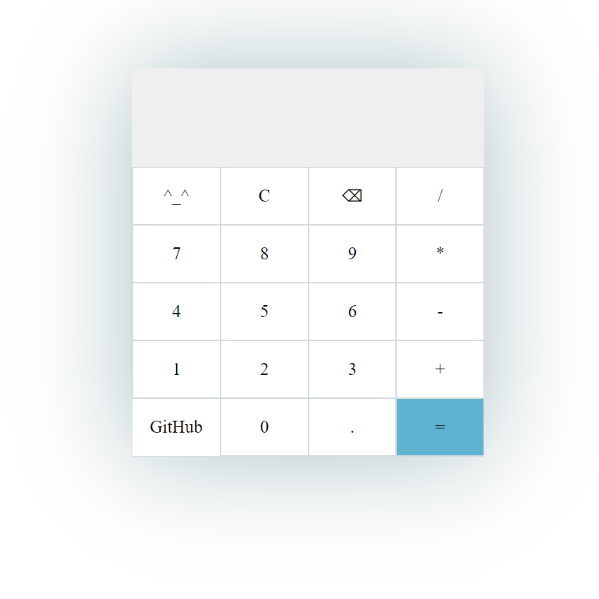

# Práctica de HTML, CSS y JavaScript (Calculadora)
En este caso realice una Calculadora básica.

---

## Recomendaciones
- Usar Google Chrome, Mozilla Firefox, Opera GX, etc

---

## Importante
- Es algo sencillo tanto de hacer como de usar, más que nada su finalidad de creación fue mejorar mis habilidades con HTML, CSS y JavaScript
- Está es una práctica por parte de "Launch X"

---

